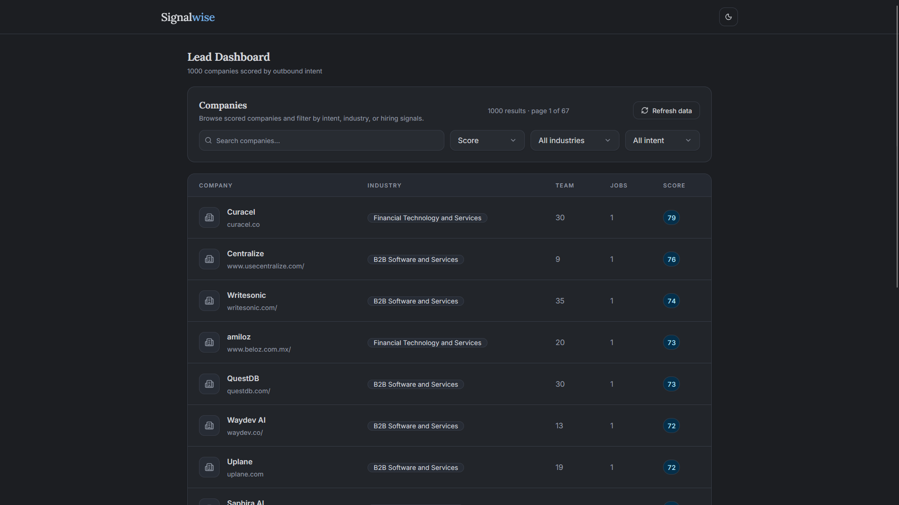
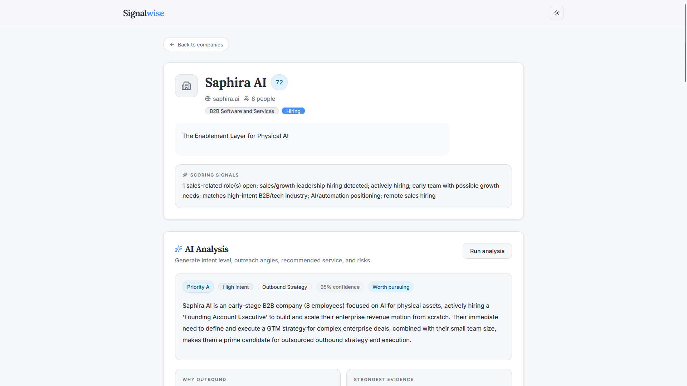
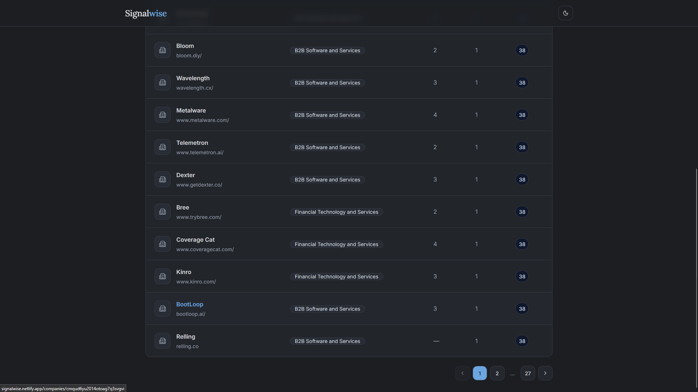
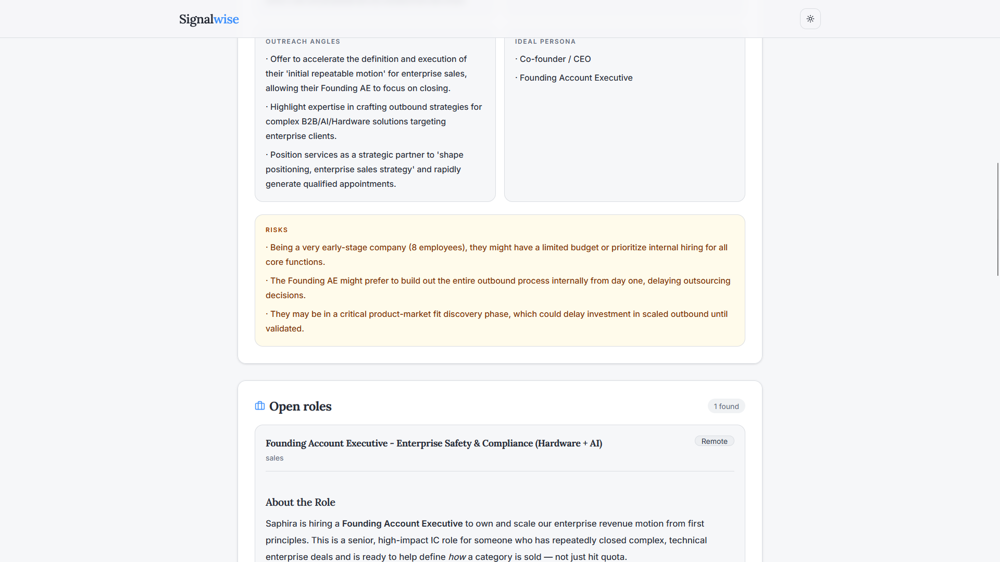

# leadscore

An AI-powered lead intelligence platform that discovers and prioritizes companies likely to need outbound sales or appointment-setting services. It ingests public hiring data from Y Combinator Work at a Startup, enriches company profiles, scores buying intent using rule-based signals, and uses Gemini to generate qualitative analyses, outreach angles, buyer personas, and potential risks.

## stack

next.js, typescript, prisma, postgresql (neon), tailwind css, gemini api

## deployment

frontend: https://signalwise.netlify.app

backend/database:
- neon postgresql
- gemini api

## features

- automated ingestion of public company and hiring data
- rule-based outbound intent scoring
- searchable and filterable lead dashboard
- detailed company profiles
- on-demand AI analysis using Gemini
- automated database refresh pipeline
- responsive UI built with Tailwind CSS

## scoring logic

Companies are scored based on a combination of growth and outbound-buying signals, including:

- sales and business development hiring
- leadership hiring (Head of Growth, VP Sales, etc.)
- hiring activity
- team size
- industry
- growth-related language
- AI/automation positioning
- remote sales hiring

The generated score is then supplemented with an AI-generated qualitative assessment.

## project structure

### data pipeline

- **sync**: imports public hiring data from Y Combinator Work at a Startup.
- **importer**: normalizes company and job data into PostgreSQL using Prisma.
- **scoring**: evaluates companies using rule-based intent scoring.
- **refresh**: clears and repopulates the database with fresh data.

### frontend

- **dashboard**: searchable list of companies with intent scores.
- **company page**: detailed company information, hiring signals, and AI analysis.
- **api**: server routes for company analysis and database refresh.
- **components**: reusable UI components including tables, badges, filters, and markdown rendering.

### database

- **Company**
- **Job**
- **Signal**
- **CompanySource**

Designed to support future enrichment from additional public data sources.

## ai analysis

Gemini is used on demand to generate:

- intent level
- buying rationale
- strongest evidence
- outreach angles
- recommended service
- ideal buyer personas
- potential risks
- paani ki tangi

AI analysis complements the rule-based score rather than replacing it.

## o/p demo ss

